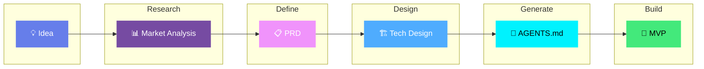

<p align="center">
  
</p>

<h3 align="center">A practical AI workflow for shipping MVPs</h3>

<p align="center">
  <strong>Turn an idea into an MVP with structured prompts, agent docs, and AI-assisted coding workflows.</strong>
</p>

<p align="center">
  Used on projects like <a href="https://vibeworkflow.app">vibeworkflow.app</a>, <a href="https://moneyvisualiser.com">moneyvisualiser.com</a>, <a href="https://caglacabaoglu.com">caglacabaoglu.com</a>, and <a href="https://alpyalay.org/realdex">RealDex App</a>.
</p>

<p align="center">
  <a href="LICENSE"></a>
  <a href="http://makeapullrequest.com"></a>
  <a href="https://github.com/KhazP/vibe-coding-prompt-template/stargazers"></a>
  <a href="https://github.com/KhazP/vibe-coding-prompt-template/issues"></a>
</p>

<p align="center">
  
  
  
  
  
</p>

---

## Table of contents
- [Built with this workflow](#built-with-this-workflow)
- [Workflow overview](#workflow-overview)
- [Quick start and the 5 steps](#quick-start-and-the-5-steps)
- [Prerequisites and tools](#prerequisites-and-tools)
- [Advanced agent practices](#advanced-agent-practices)
- [Project structure and deployment](#project-structure-and-deployment)
- [Common pitfalls and troubleshooting](#common-pitfalls-and-troubleshooting)
- [Further reading](#further-reading)

---

## Built with this workflow

This repo documents the workflow behind a handful of shipped projects. The goal is simple: do the thinking upfront, hand clean context to your tools, and keep the build phase moving.

| Project | What it is |
| :-- | :-- |
| [vibeworkflow.app](https://vibeworkflow.app) | An interactive web app built around the same structured vibe-coding workflow documented here. |
| [moneyvisualiser.com](https://moneyvisualiser.com) | A money visualization website that visualized money in a 3D environment. |
| [caglacabaoglu.com](https://caglacabaoglu.com) | A production portfolio and gallery site built with the same PRD-to-agent execution approach. |
| [alpyalay.org/realdex](https://alpyalay.org/realdex) | A mobile app built on React Native that lets you catch animals, and put them in a Pokemon-like collection. |

<p align="center">
  <sub>Maintained by <a href="https://x.com/alpyalay">Alp Yalay</a>.</sub>
</p>

---

## Workflow overview

The process moves through five stages, from idea validation to working code:



<p align="center">
  <a href=".claude/README.md">
    
  </a>
  <a href="https://vibeworkflow.app/#/vibe-coding">
    
  </a>
</p>

---

## Quick start and the 5 steps

> TL;DR: run research, turn it into a PRD, choose the stack, generate your agent files, then build in small passes.

### Phase 1: thinking through the product
Do the first three steps in ChatGPT, Claude.ai, Gemini, or any other chat tool. You do not need a repo yet.

###  Deep Research
<details open>
<summary><b>Check whether the idea is worth building</b> - 20-30 min</summary>

This step gives you a quick read on demand, competitors, and whether the scope looks realistic.

1. Open [`part1-deepresearch.md`](part1-deepresearch.md) and **copy all of its contents**.
2. **Paste it** into your preferred AI platform Chat (like Claude.ai, ChatGPT, or Gemini) and press **Enter**.
3. The AI will ask you a few questions about your idea. Answer them truthfully in the chat.
4. The AI will generate a comprehensive research document based on your answers.
5. **Save the output** into a local file named `research-[YourAppName].md` (or `.txt`) or simply **keep this chat open** for Step 2.

Tip: if your chat tool supports web search, turn it on so the stats and competitor references are current.
</details>

###  Product Requirements (PRD)
<details open>
<summary><b>Write down what the MVP actually needs to do</b> - 15-20 min</summary>

This turns the rough idea into a scope you can build against.

1. Copy the contents of [`part2-prd-mvp.md`](part2-prd-mvp.md).
2. **Option A (Same Chat):** If you kept your chat open, paste the prompt right below the Deep Research output.
3. **Option B (New Chat):** Start a fresh chat, paste your saved `research-[YourAppName].md` content, and then paste the Part 2 prompt below it.
4. Press Enter, answer any clarifying questions the AI asks, and let it generate your requirements.
5. **Save the final output** as `PRD-[YourAppName]-MVP.md`.
</details>

###  Technical Design
<details open>
<summary><b>Pick a stack you can actually ship with</b> - 15-20 min</summary>

This step helps you choose the stack and decide where to keep things simple.

1. Copy the contents of [`part3-tech-design-mvp.md`](part3-tech-design-mvp.md).
2. Paste it into your **ongoing conversation** (or into a new one, making sure to attach the `PRD-[YourAppName]-MVP.md` from Step 2 as context).
3. The AI will ask questions regarding your budget, timeline, and complexity tolerance.
4. Discuss the trade-offs it presents (e.g., full-code vs. no-code builder).
5. Once a stack is decided, **save the output** as `TechDesign-[YourAppName]-MVP.md`.
</details>

### Phase 2: execution in your IDE
Move into Cursor, VS Code with Copilot, Claude Code, or your preferred coding setup. This is where the project becomes code.

###  Set up the agent files
<details open>
<summary><b>Create the docs and instructions your coding agent will rely on</b> - 1-2 min</summary>

This step fills out `AGENTS.md` and the supporting docs from your PRD and tech design.

1. Click **"Use this template"** in GitHub (or clone this repository locally).
2. Open this cloned repository folder in your **AI IDE** (like Cursor or VS Code).
3. Create a `docs/` folder in your project root if it does not already exist.
4. Move your saved documents into `docs/` using these names:
   - `docs/PRD-[YourAppName]-MVP.md`
   - `docs/TechDesign-[YourAppName]-MVP.md`
   - optional: `docs/research-[YourAppName].md` (or `.txt` for backward compatibility)
5. Open the AI Chat inside your IDE, type: *"Read [`part4-notes-for-agent.md`](part4-notes-for-agent.md), follow its instructions, and set up my workspace."*
6. The agent should copy the boilerplates from `/templates/` into your project root and fill in the placeholders using the files in `docs/`.
</details>

###  Build with AI Agent
<details open>
<summary><b>Build the MVP in small, reviewable chunks</b> - 1-3 hrs</summary>

Choose your development environment and start iterating:

1. Ensure your newly generated `AGENTS.md` and configuration files are physically in the project folder.
2. Give your agent its **first command:** 
   > *"Read AGENTS.md, propose a Phase 1 plan, wait for my approval, and then build it step by step."*
3. Treat the agent like a junior developer. Ask it to stop after each major feature, explain the diff, and run tests where possible.
4. **Repeat the loop** until your MVP is complete:

**Recommended Loop:**
```text
╭──────────────╮      ╭──────────────╮      ╭──────────────╮
│   📝 Plan    │ ───>│  ⚡ Execute │ ───>│  🔍 Verify  │
│  (Approve)   │      │  (One Feat)  │      │    (Test)    │
╰──────────────╯      ╰──────────────╯      ╰──────────────╯
       ▲                                           │
       └───────────────────────────────────────────┘
```
</details>

---

## Prerequisites and tools

You need a modern browser, a few hours, and enough comfort with files and copy-paste to move between tools. You do not need to be an experienced developer.

### Platform selection guide

| Focus Area | Recommended Tools |
|------------|-------------------|
| **Fast Prototype (Full-stack)** |  (Includes Agent/Plan mode, DB, Auth) |
| **Production-Ready Frontend** |  (Vercel-native, exact Next.js/React components) |
| **Learning / Sandbox Coding** |  (Dynamic Context) or VS Code with Copilot |
| **Complex Logic / Multi-Agent** |  (Agent Teams) or GitHub Copilot CLI |
| **Budget-Limited** |  (Free) + VS Code |

Note: I would not use this workflow as-is for native hardware work, heavily regulated products, or safety-critical systems.

---

## Advanced agent practices

<details open>
<summary><b>1. Artifact-first memory and compaction</b></summary>

To avoid context overload, let the agent write things down instead of trying to keep everything in one giant chat:
- **Compaction and handoffs:** Use native compaction (`/compact` in Copilot CLI, Claude Code logic) instead of hard resets. When you switch sessions, have the agent write a `001-spec.md` or `recap.md` and load only that file into the new chat.
- **Dynamic context (Cursor):** Let the agent save findings into real files instead of burying them in chat history.
- If you must restart, attach `AGENTS.md`, `docs/PRD-[YourAppName]-MVP.md`, and your latest handoff artifact.
</details>

<details open>
<summary><b>2. Multi-agent orchestration and plugins</b></summary>

- **Agent teams:** Tools like Claude Code support multiple agents working in parallel. Treat them like assigned roles, not magic.
- **Plan before edit:** Ask for an approved plan from the lead agent before the execute agent starts changing files. It cuts down on silent regressions.
- Keep `AGENTS.md` as the source of truth, then add tool-specific plugins or `.cursor/rules/` to seamlessly extend capabilities.
</details>

<details>
<summary><b>3. Model strategy matrix</b></summary>

Use model families instead of pinned version names. It ages better as models get swapped underneath you.

| Strategy | Primary Families | Best For | Speed |
|----------|------------------|----------|:-----:|
| Speed-first | Gemini Flash, Claude Sonnet | Fast prototyping, broad iteration | High |
| Balanced | Claude Sonnet, Gemini Pro | Daily coding, debugging, planning | Med-High |
| Depth-first | Claude Opus, Gemini Pro | Deep reasoning, complex refactors | Medium |
</details>

<details>
<summary><b>4. Agent observability</b></summary>

When an agent ignores instructions or behaves inconsistently:
1. Check which instructions/rules/hooks were loaded.
2. Confirm tool permissions and blocked actions.
3. Verify the active session context was not reset.
4. Re-run with explicit instruction order: *"Read AGENTS.md, then agent_docs/, then execute."*
</details>

---

## Project structure and deployment

### Recommended project skeleton
```
your-app/
├── 📁 docs/
│   ├── research-YourApp.md
│   ├── PRD-YourApp-MVP.md
│   └── TechDesign-YourApp-MVP.md
├── 📁 agent_docs/
│   ├── tech_stack.md
│   ├── code_patterns.md
│   ├── project_brief.md
│   ├── product_requirements.md
│   └── testing.md
├── 📄 AGENTS.md                  # Universal AI instructions (The Master Contract)
├── 📄 MEMORY.md                  # Artifact-first memory for session continuity
├── 📁 specs/                     # Agent handoff artifacts (e.g. 001-feature-spec.md)
├── 📁 .cursor/rules/             # Cursor rules (preferred)
└── 📁 src/                       # Your application code
```

### Deployment and security

Once the MVP works, do a final pass on secrets, auth, and basic abuse protections before you deploy:

1. **Security Pass:** Check dependencies, secrets, auth paths, and rate limits.
2. **Push & Deploy:**
   -  For Next.js, React, frontend apps.
   -  For Static sites, edge functions.

---

## Common pitfalls and troubleshooting

<details>
<summary><b>Avoid these mistakes</b></summary>

| Pitfall | Solution |
|---------|----------|
| Skipping discovery work | Run the Part 1 research prompt first |
| Letting agents ship code alone | Review the diff and run tests before merging |
| Publishing auto-generated UIs | Test accessibility and security before launch |
| Forcing one tool to do everything | Mix tools, IDE + terminal + builder usually works better |

</details>

<details>
<summary><b>Agent troubleshooting</b></summary>

| Problem | Solution |
|---------|----------|
| **"AI ignores my docs"** | Say: *"First read AGENTS.md, PRD, and TechDesign. Summarize key requirements before coding."* |
| **"Code doesn't match PRD"** | Say: *"Re-read the PRD section on [feature], list acceptance criteria, then refactor."* |
| **"AI is overcomplicating"** | Add to config: *"Prioritize MVP scope. Offer the simplest working implementation."* |
| **"Deployment failing"** | Request: *"Walk through deployment checklist, verify env vars, then run health check."* |

</details>

### Download and releases
- Use this repository directly via **Use this template**.
- Stable snapshots are listed on [GitHub Releases](https://github.com/KhazP/vibe-coding-prompt-template/releases).

### Communication channels
- Discussions: [GitHub Discussions](https://github.com/KhazP/vibe-coding-prompt-template/discussions)
- Bug reports: [GitHub Issues](https://github.com/KhazP/vibe-coding-prompt-template/issues)
- Security reports: [Private security advisory form](https://github.com/KhazP/vibe-coding-prompt-template/security/advisories/new)

### Community and policies
This project is free and open source under MIT. Contributions are welcome in all forms (docs, examples, fixes, and suggestions).

- Contribution guide: [.github/CONTRIBUTING.md](.github/CONTRIBUTING.md)
- Code of conduct: [.github/CODE_OF_CONDUCT.md](.github/CODE_OF_CONDUCT.md)
- Security policy: [.github/SECURITY.md](.github/SECURITY.md)
- Governance: [.github/GOVERNANCE.md](.github/GOVERNANCE.md)
- Support: [.github/SUPPORT.md](.github/SUPPORT.md)
- FAQ: [.github/FAQ.md](.github/FAQ.md)
- Checklist: [.github/CHECKLIST.md](.github/CHECKLIST.md)

---

## Further reading

- [Claude agent teams — multi-agent orchestration patterns](docs/claude-agent-teams.md)
- [Cursor cloud agents — cloud-based Cursor agent setup](docs/cursor-cloud-agents.md)
- [Freshness policy — how time-sensitive content is maintained](docs/freshness-policy.md)
- [Golden path checklist — end-to-end workflow validation](docs/golden-path-checklist.md)

---

## Monthly update cadence
This template is maintained monthly. Review tool deprecations, refresh model-family references, and update agent capability notes when the ecosystem shifts.

## Contributing

<p align="center">
  <a href="https://github.com/KhazP/vibe-coding-prompt-template/graphs/contributors">
    
  </a>
  <a href="https://github.com/KhazP/vibe-coding-prompt-template/network/members">
    
  </a>
</p>

PRs and issues are welcome. If you adapt this workflow, add a new tool setup, or ship something interesting with it, that is useful context for everyone else too. For community Q&A and roadmap ideas, use [Discussions](https://github.com/KhazP/vibe-coding-prompt-template/discussions). See [.github/CONTRIBUTING.md](.github/CONTRIBUTING.md) for contribution guidelines.

---

## License

Released under the [MIT License](LICENSE).

---

<p align="center">
  <strong>If this workflow helps you ship something real, open an issue or PR and show what changed.</strong>
</p>

<p align="center">
  <sub>Created by <a href="https://x.com/alpyalay">@alpyalay</a> and improved through community contributions.</sub>
</p>

<p align="center">
  <a href="#workflow-overview">
    
  </a>
</p>
